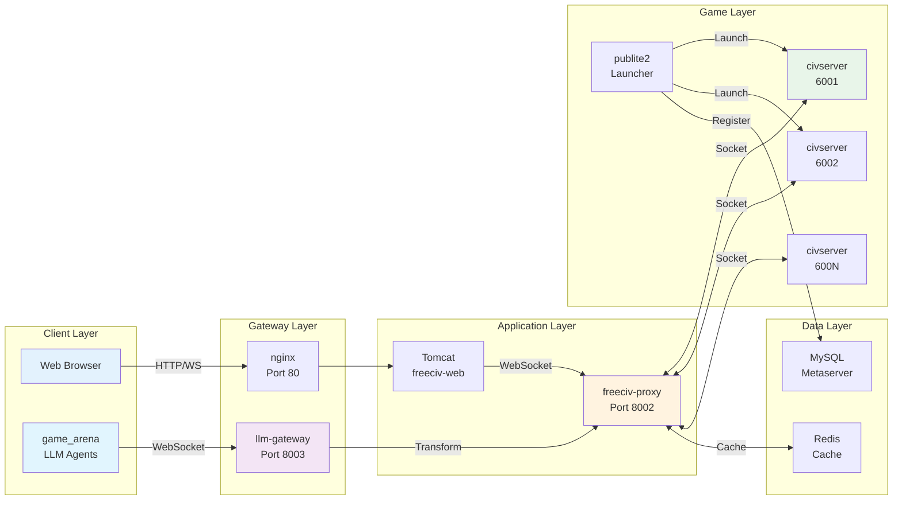

FCIV.NET Freeciv 3D 
-------------------

[](https://www.gnu.org/licenses/agpl-3.0)
[](https://github.com/fciv-net/fciv-net/actions?query=workflow%3A%22continuous+integration%22)


[Fciv.net](https://www.fciv.net) is an open-source turn-based strategy game. It can be played in a web-browser which supports HTML5 and WebGL 2 or WebGPU. The game features in-depth game-play and a wide variety of game modes and options. Your goal is to build cities, collect resources, organize your government, and build an army, with the ultimate goal of creating the best civilization. You can play online against other players (multiplayer) or play by yourself against the computer.

FCIV.NET is free and open source software. The Freeciv C server is released under the GNU General Public License, while the Freeciv-web client is released
under the GNU Affero General Public License. The 3D models are also "open source" and must be made free and open source. See [License](LICENSE.md) for the full license document.

FCIV.NET is a game about history. The developers of this game encourages peace and technological development as a winning strategy.


Live servers
------------
Currently known servers based on FCIV.NET / Freeciv-web, which are open source in compliance with [the AGPL license](LICENSE.md):


FCIV-NET screenshots:
------------------------


Overview
--------

Freeciv-Web consists of these components:

* [Freeciv-web](freeciv-web) - a Java web application for the Freeciv-web client.
  This application is a Java web application which make up the application
  viewed in each user's web browser. The Metaserver is also a part of this module.
  Implemented in Javascript, Java, JSP, HTML and CSS. Built with maven and runs 
  on Tomcat and nginx.

* [Freeciv](freeciv) - the Freeciv C server, which is checked out from the official
  Git repository, and patched to work with a WebSocket/JSON protocol. Implemented in C.

* [Freeciv-proxy](freeciv-proxy) - a WebSocket proxy which allows WebSocket clients in Freeciv-web
  to send socket requests to Freeciv servers. WebSocket requests are sent from Javascript
  in Freeciv-web to nginx, which then proxies the WebSocket messages to freeciv-proxy,
  which finally sends Freeciv socket requests to the Freeciv servers. Also includes an
  LLM gateway for AI agent integration via WebSocket API. Implemented in Python.

* [Publite2](publite2) - a process launcher for Freeciv C servers, which manages
  multiple Freeciv server processes and checks capacity through the Metaserver.
  Implemented in Python.

* [LLM Gateway](llm-gateway) - a FastAPI-based WebSocket gateway that enables AI agent integration.
  Provides a pass-through layer for game_arena LLM agents to control FreeCiv games via WebSocket API.
  Includes connection management, rate limiting, authentication, and message transformation.
  Implemented in Python. **(Starts automatically with sensible defaults)**

### Architecture Diagram



**Standard players** connect via web browser → nginx → Tomcat → freeciv-proxy → civserver

**LLM agents** connect via WebSocket → llm-gateway → freeciv-proxy → civserver

For detailed integration documentation, see [Technical Spec.md](Technical%20Spec.md).

Freeciv 3D
-------------
Freeciv 3D is the 3D version using the Three.js 3D engine, which requires WebGl 2 or WebGPU support.

Running Freeciv-web on your computer
------------------------------------
The recommended and probably easiest way is to use Docker. Freeciv-web can also be run with WSL. In some cases it may be easier.

Check out Freeciv-web to a
directory on your computer, by installing [Git](http://git-scm.com/) and
running this command:
 ```bash
  git clone https://github.com/freeciv3d/freeciv3d.git --depth=10
 ```

You may also want to change some parameters before installing, although
it's not needed in most cases. If you have special requirements, have a look
at [config.dist](config/config.dist),
copy it without the `.dist` extension and edit to your liking.


All software components in Freeciv-web will log to the /logs sub-directory of the Freeciv-web installation.


### Running Freeciv-web on Docker

Freeciv-web can easily be built and run from Docker using `docker-compose`.

 1. Make sure you have both [Docker](https://www.docker.com/get-started) and [Docker Compose](https://docs.docker.com/compose/install/) installed.

 2. Run the following from the freeciv-web directory:

    ```sh
    docker-compose up -d
    ```

 3. Connect to docker via host machine using standard browser

http://localhost:8080/

#### LLM Gateway for AI Integration

FreeCiv3D includes an LLM Gateway that enables AI agents (like those in game_arena) to play FreeCiv through a WebSocket API. The complete gateway system starts automatically with sensible defaults - no configuration needed for testing.

**Architecture:**

The LLM Gateway consists of two components that start automatically:

1. **Dedicated FreeCiv Proxy (Port 8002)** - Provides `/llmsocket/8002` endpoint for LLM agents
2. **LLM Gateway API (Port 8003)** - Pass-through layer that connects to the proxy

**Quick Start:**
```bash
# Start services (both components start automatically)
docker-compose up -d

# The LLM WebSocket gateway will be available at:
# ws://localhost:8003/ws/agent/{agent_id}

# Verify both components started
docker logs fciv-net | grep -E "(FreeCiv proxy|LLM Gateway)"
# Expected output:
# ✓ FreeCiv proxy started on port 8002 (PID: XXXXX)
# ✓ LLM Gateway started on port 8003 (PID: XXXXX)
```

**For game_arena Integration:**

The gateway uses authentication tokens to secure connections from game_arena. Default tokens are provided for testing:

* `test-token-fc3d-001`
* `test-token-fc3d-002`

**For Production:**

Set custom authentication tokens in docker-compose.yml:
```yaml
services:
  fciv-net:
    environment:
      - LLM_API_TOKENS=your-prod-token-1,your-prod-token-2
```

Or use a `.env` file (see [`.env.example`](.env.example) for all options).

**Note**: LLM provider API keys (OpenAI, Gemini, etc.) are handled by game_arena, not freeciv3d.

**Local Development Setup:**
```bash
# 1. Create logs directory
mkdir -p logs

# 2. Start freeciv-proxy locally (for development/testing)
cd freeciv-proxy
CACHE_HMAC_SECRET="abcdef1234567890abcdef1234567890abcdef1234567890abcdef1234567890" \
API_KEY_SECRET="test1234567890123456789012345" \
LLM_API_TOKENS="test-token-fc3d-001,test-token-fc3d-002" \
python3 freeciv-proxy.py

# 3. Test LLM gateway connection
python3 tests/test_llm_websocket.py localhost 8002

# 4. Test Docker build (optional)
./tests/test_docker_build.sh
```

For detailed Docker optimization information, see [DOCKER_OPTIMIZATION.md](DOCKER_OPTIMIZATION.md).

**game_arena Integration:**
To connect game_arena to FreeCiv3D:

```python
from game_arena.harness.freeciv_proxy_client import FreeCivProxyClient

client = FreeCivProxyClient(
    host="localhost",
    port=8002,
    api_token="test-token-fc3d-001",
    agent_id="my_ai_agent",
    game_id="test_game"
)

# Connect and play
await client.connect()
state = await client.get_state()
# ... AI logic here ...
```

Start and stop Freeciv-web with the following commands:
  start-freeciv-web.sh
  stop-freeciv-web.sh
  status-freeciv-web.sh

### Running Freeciv-web on Windows Subsystem for Linux (WSL)
[Windows Subsystem for Linux (WSL)](/doc/Windows%20Subsystem%20for%20Linux.md)

Developers interested in Freeciv-web
------------------------------------

If you want to contibute to Freeciv-web, see the [issues](https://github.com/fciv-net/fciv-net/issues) on GibHub for some tasks you can work on. Pull requests and suggestions/issues on Github are welcome! 


Contributors to Freeciv-web
---------------------------
Andreas Røsdal  [@andreasrosdal](https://github.com/andreasrosdal)  
Marko Lindqvist [@cazfi](https://github.com/cazfi)  
Sveinung Kvilhaugsvik [@kvilhaugsvik](https://github.com/kvilhaugsvik)  
Gerik Bonaert [@adaxi](https://github.com/adaxi)  
Lmoureaux [@lmoureaux](https://github.com/lmoureaux)  
Máximo Castañeda [@lonemadmax](https://github.com/lonemadmax)  
and the [Freeciv.org project](https://www.freeciv.org/wiki/People)!
