# Technical Specification: FreeCiv3D Integration with Game Arena Framework

# Technical Specification: FreeCiv3D Integration with Game Arena Framework

## Executive Summary

This specification details the technical architecture for integrating Large Language Model (LLM) agents into FreeCiv3D through an extended Game Arena framework. The MVP solution consists of two primary servers:

1. **Game Arena Server** - Extended to handle LLM proxy connections and game control
2. **FreeCiv3D Server** - Modified to support headless LLM gameplay

The MVP focuses on enabling a single game between two manually configured LLMs with a specific game configuration.

## 1. Architecture Overview

### 1.1 Two-Server Architecture

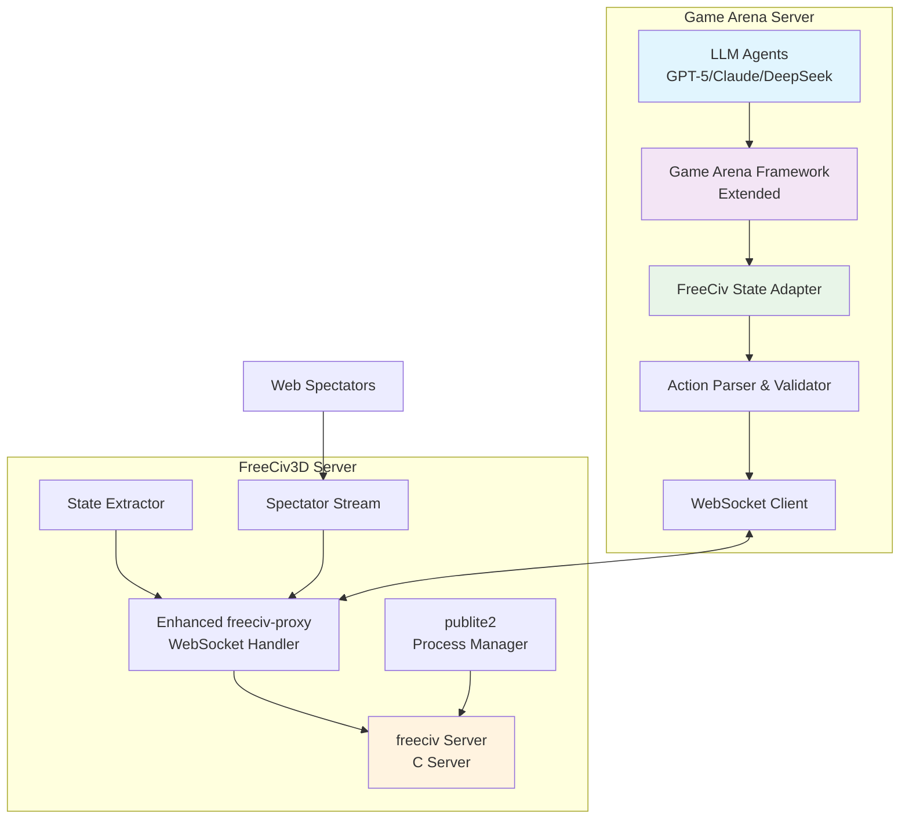

### 1.2 MVP Communication Flow

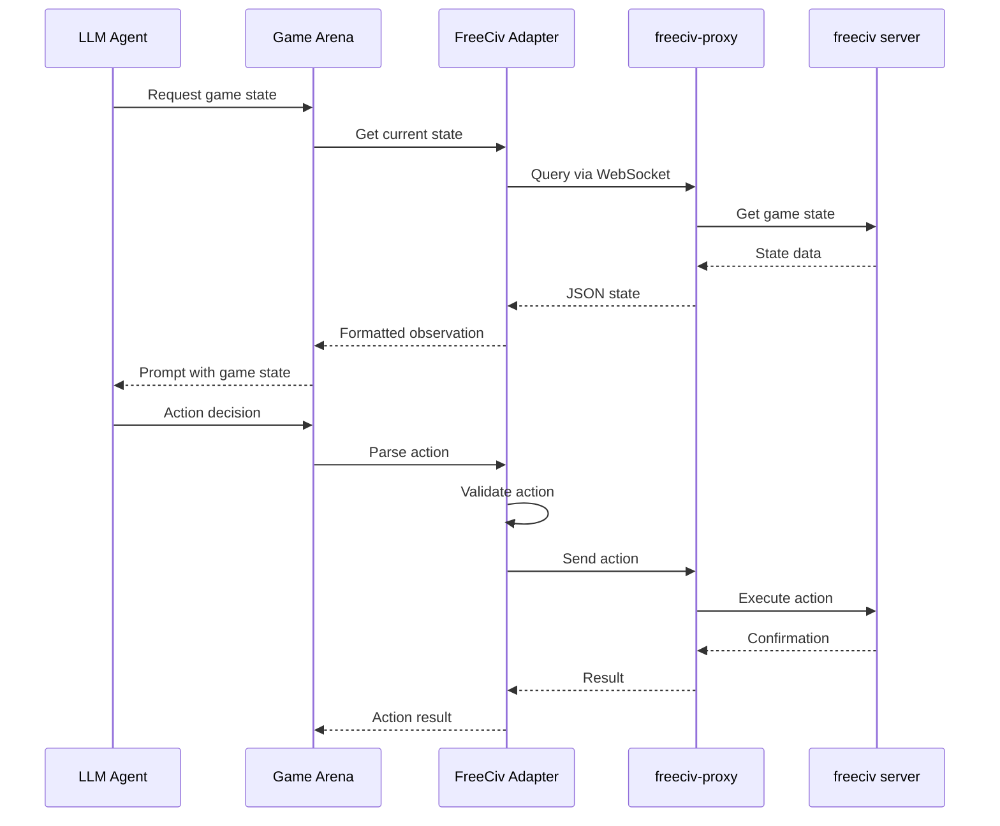

### 1.3 LLM Gateway Integration Architecture

The llm-gateway component acts as a WebSocket pass-through layer between game_arena and freeciv-proxy, providing connection management, rate limiting, and message transformation.

#### Component Diagram

```mermaid
graph TB
    subgraph "game_arena (External)"
        GA[Game Arena<br/>Agents]
    end

    subgraph "freeciv3d Docker Container"
        subgraph "LLM Gateway (Port 8003)"
            GW[FastAPI App]
            WSH[WebSocket Handler]
            CM[Connection Manager]
            RL[Rate Limiter]
            TM[Token Manager]
        end

        subgraph "FreeCiv Proxy (Port 8002)"
            FP[Tornado Proxy]
            LH[LLM Handler]
            CC[CivCom Thread]
        end

        subgraph "Game Servers"
            CS1[civserver:6001]
            CS2[civserver:6002]
            CSN[civserver:600N]
        end

        subgraph "Support Services"
            MS[MySQL<br/>Metaserver DB]
            PUB[publite2<br/>Server Launcher]
            RED[Redis<br/>State Cache]
        end
    end

    GA -->|ws://host:8003/ws/agent/{id}| WSH
    WSH --> CM
    WSH --> RL
    WSH --> TM
    WSH -->|Transform & Forward| LH
    LH --> CC
    CC -->|IOLoop.add_callback| FP
    FP <-->|Socket| CS1
    FP <-->|Socket| CS2
    FP <-->|Socket| CSN
    PUB -->|Launch| CS1
    PUB -->|Launch| CS2
    PUB -->|Register| MS
    LH <-->|Cache| RED

    style GA fill:#e1f5fe
    style GW fill:#f3e5f5
    style FP fill:#fff3e0
    style CS1 fill:#e8f5e9
```

#### Message Flow with IOLoop Threading Fix

The critical fix in commit d1083b2 corrected a Tornado IOLoop threading violation that caused the black screen issue:

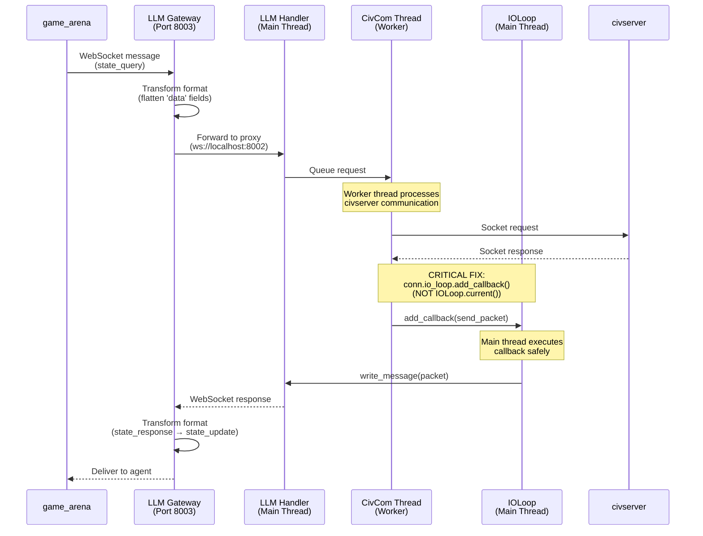

**Why This Matters:**
- `IOLoop.current()` returned the **worker thread's** IOLoop (inactive/wrong)
- Packets queued to wrong IOLoop were never delivered → black screen
- Caused code 1006 WebSocket disconnects after initial connection
- **Fix**: Use `conn.io_loop` (captured during WebSocket setup, always main thread)
- Result: Packets flow correctly from civserver → proxy → gateway → game_arena

#### Port Mapping Reference

| Service | Internal Port | External Access | Purpose |
|---------|--------------|-----------------|---------|
| nginx | 80 | `:8080` | Web UI, static assets |
| Tomcat | 8080 | `:8080` (proxied) | Java servlets, JSP |
| **LLM Gateway** | 8003 | `:8003` | **game_arena WebSocket API** |
| **FreeCiv Proxy** | 8002 | `:8002` | **Main proxy for all connections** |
| civserver | 6000-6009 | Internal only | Game server instances |
| Proxy per-game | 7000-7009 | Internal only | Dedicated proxies (managed by publite2) |
| MySQL | 3306 | Internal only | Metaserver database |
| Redis | 6379 | Internal only | State cache, rate limiting |

#### Server Allocation API

The LLM Gateway integration includes a **dynamic server pool management system** that prevents port conflicts in concurrent LLM games. Game servers (ports 6000-6009) are treated as shared resources that must be explicitly allocated before use and released after completion.

##### Architecture Pattern

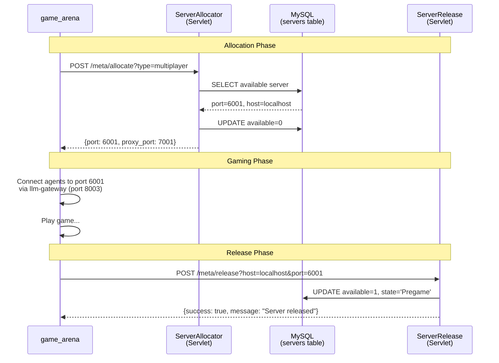

##### ServerAllocator Servlet

**Purpose**: Allocates an available game server from the pool.

**Endpoint**: `POST /freeciv-web/meta/allocate`

**Request**:
```http
POST /freeciv-web/meta/allocate?type=multiplayer HTTP/1.1
```

**Response**:
```json
{
  "success": true,
  "host": "localhost",
  "port": 6001,
  "proxy_port": 7001,
  "type": "multiplayer"
}
```

**Implementation** ([ServerAllocator.java](freeciv-web/src/main/java/org/freeciv/servlet/ServerAllocator.java)):
```sql
-- Find available server
SELECT host, port FROM servers
WHERE type = ? AND state = 'Pregame' AND available = 1
ORDER BY port LIMIT 1

-- Mark as unavailable
UPDATE servers SET available = 0, stamp = NOW()
WHERE host = ? AND port = ?
```

**Key Logic**:
- Proxy port calculated as `game_port + 1000` (e.g., 6001 → 7001)
- Marks server as `available = 0` to prevent concurrent allocation
- Returns 503 if no servers available for requested game type

##### ServerRelease Servlet

**Purpose**: Returns a game server to the available pool after game completion.

**Endpoint**: `POST /freeciv-web/meta/release`

**Request**:
```http
POST /freeciv-web/meta/release?host=localhost&port=6001 HTTP/1.1
```

**Response**:
```json
{
  "success": true,
  "host": "localhost",
  "port": 6001,
  "message": "Server released and available"
}
```

**Implementation** ([ServerRelease.java](freeciv-web/src/main/java/org/freeciv/servlet/ServerRelease.java)):
```sql
-- Return server to pool
UPDATE servers SET available = 1, state = 'Pregame', stamp = NOW()
WHERE host = ? AND port = ?
```

##### MetaserverClient (Python)

The llm-gateway provides a Python client for calling these servlets ([metaserver_client.py](llm-gateway/metaserver_client.py)):

```python
from llm_gateway.metaserver_client import metaserver_client

# Allocate server
server_info = await metaserver_client.allocate_server(game_type="multiplayer")
# Returns: {"host": "localhost", "port": 6001, "proxy_port": 7001}

# Use server for game...

# Release when done
await metaserver_client.release_server("localhost", 6001)
```

**Why This Matters**:
- **Prevents Port Conflicts**: Multiple concurrent LLM games can run without collision
- **Resource Pooling**: Efficient utilization of game server capacity (10 servers support 10 concurrent games)
- **Clean Separation**: Server lifecycle management (servlets) separate from game communication (llm-gateway)
- **Scalability**: Easy to add more servers by updating the `servers` table

For complete API documentation, see [llm-gateway/README.md](llm-gateway/README.md).

#### Service Startup Sequence

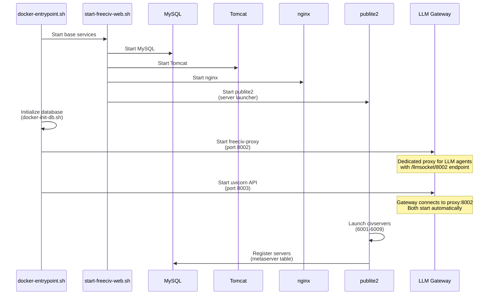

#### Authentication Flow

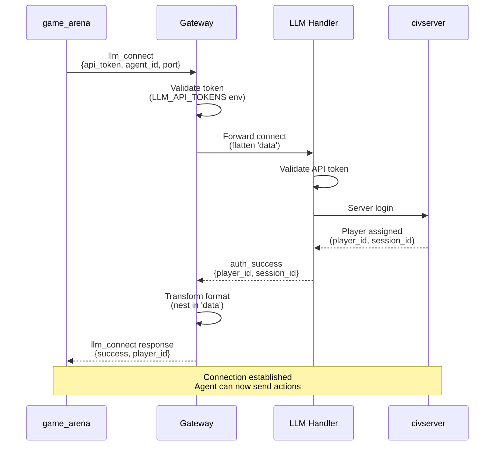

#### Error Recovery Patterns

**Connection Health Monitoring:**
- Gateway pings proxy every 30s
- Auto-reconnect on disconnect (exponential backoff)
- Circuit breaker after 5 failures (5min cooldown)

**Memory Leak Prevention (commit 8e7bdfb):**
- publite2 cleanup_dead_servers() before spawning
- Thread termination after 10 consecutive errors
- Connection pooling with max limits
- Prevents unbounded thread/process accumulation

**Rate Limiting:**
- Per-agent: 100 requests/min
- Per-message: 1MB max size
- Concurrent connections: 50 per instance

## 2. Game Arena Server Components

### 2.1 FreeCiv State Adapter

The state adapter bridges OpenSpiel's game state interface with FreeCiv's complex state representation.

```python
class FreeCivState(GameState):
    def __init__(self, raw_state: dict):
        super().__init__()
        self.map = self._parse_map(raw_state['map'])
        self.players = self._parse_players(raw_state['players'])
        self.units = self._parse_units(raw_state['units'])
        self.cities = self._parse_cities(raw_state['cities'])
        self.turn = raw_state['game']['turn']
        self.phase = raw_state['game']['phase']

    def get_legal_actions(self, player_id: int) -> List[FreeCivAction]:
        """
        Return all legal actions for the specified player.

        Uses the flat legal_actions list from proxy state (rule-based, ~80% accuracy).
        The proxy generates actions using game rules without server validation.
        """
        if player_id not in self.players:
            return []

        # Get pre-computed actions from proxy's legal_actions field
        raw_actions = self._state_data.get('legal_actions', [])

        # Parse raw action dicts into FreeCivAction objects
        actions = []
        for action_data in raw_actions:
            if isinstance(action_data, dict):
                action = self._parse_action(action_data)
                if action:
                    actions.append(action)

        return actions

    def to_observation(self, player_id: int, format: str = 'enhanced') -> dict:
        """Generate LLM-optimized observation"""
        if format == 'enhanced':
            return self._build_llm_observation(player_id)
        elif format == 'json':
            return self._to_json_observation(player_id)
        elif format == 'ascii':
            return self._to_ascii_observation(player_id)

```

### 2.2 LLM-Optimized Observation Format

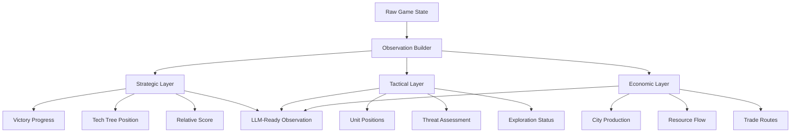

### 2.3 Action Space Definition

```python
@dataclass
class FreeCivAction:
    action_type: str  # "unit_move", "city_production", "tech_research"
    actor_id: int     # unit_id or city_id
    target: Union[Dict[str, int], int]  # coordinates or target_id
    parameters: Dict[str, Any]  # action-specific parameters

    def to_packet(self) -> dict:
        """Convert to FreeCiv protocol format"""
        if self.action_type == "unit_move":
            return {
                "pid": 31,  # PACKET_UNIT_ORDERS
                "unit_id": self.actor_id,
                "dest_x": self.target["x"],
                "dest_y": self.target["y"]
            }

```

### 2.4 Enhanced Prompt Generation for LLMs

```python
class FreeCivPromptBuilder:
    def build_enhanced_prompt(self, observation: dict, legal_actions: List[FreeCivAction]) -> str:
        """Build LLM-optimized prompt with strategic context"""

        # Determine game phase for context
        phase = self._determine_phase(observation)

        # Build hierarchical context
        prompt = f"""
        GAME SITUATION - Turn {observation['turn']}
        =====================================

        STRATEGIC OVERVIEW:
        {self._build_strategic_summary(observation)}

        IMMEDIATE PRIORITIES:
        {self._identify_priorities(observation, phase)}

        AVAILABLE ACTIONS (Top 10 most impactful):
        {self._format_prioritized_actions(legal_actions, observation)}

        DECISION CONTEXT:
        - Game Phase: {phase}
        - Critical Threats: {self._assess_threats(observation)}
        - Opportunities: {self._identify_opportunities(observation)}

        Select ONE action from the available list. Consider both immediate tactical needs and long-term strategic goals.
        """
        return prompt

```

## 3. FreeCiv3D Server Modifications

### 3.1 Enhanced freeciv-proxy

The proxy layer must be extended to support headless LLM connections without browser requirements.

```python
class LLMWSHandler(WSHandler):
    def __init__(self):
        super().__init__()
        self.is_llm_agent = False
        self.agent_id = None
        self.state_cache = {}  # Cache for efficient state queries

    def handle_llm_message(self, message):
        """Process LLM-specific messages with optimizations"""
        msg_type = message.get('type')

        if msg_type == 'state_query':
            # Return cached state if fresh
            return self.get_cached_state()
        elif msg_type == 'action':
            # Validate and execute action
            return self.execute_llm_action(message['action'])
        elif msg_type == 'legal_actions':
            # Return pre-computed legal actions
            return self.get_legal_actions_optimized()

```

### 3.2 State Extraction Service

```java
@WebServlet(name = "StateExtractor", urlPatterns = {"/api/game/*/state"})
public class StateExtractorServlet extends HttpServlet {

    @Override
    protected void doGet(HttpServletRequest request, HttpServletResponse response) {
        String gameId = extractGameId(request);
        String format = request.getParameter("format"); // "full", "delta", "llm_optimized"

        GameState state = extractGameState(gameId, format);

        if ("llm_optimized".equals(format)) {
            state = optimizeForLLM(state);
        }

        response.setContentType("application/json");
        response.getWriter().write(state.toJSON());
    }

    private GameState optimizeForLLM(GameState state) {
        // Reduce state size while preserving decision-critical information
        // Group similar units, summarize distant territories, etc.
        return state.buildSummary();
    }
}

```

### 3.3 MVP Game Configuration

```python
# config/mvp_game_config.py
MVP_CONFIG = {
    "game": {
        "map_size": "small",  # Reduced for faster games
        "map_type": "continents",
        "victory_conditions": ["conquest", "score"],
        "turn_limit": 200,  # Shorter games for testing
        "ruleset": "classic"
    },
    "agents": {
        "player1": {
            "model": "gpt-5",
            "strategy": "balanced",
            "api_key": "${GPT5_API_KEY}"
        },
        "player2": {
            "model": "claude-opus",
            "strategy": "aggressive",
            "api_key": "${CLAUDE_API_KEY}"
        }
    },
    "performance": {
        "state_cache_ttl": 5,  # seconds
        "action_timeout": 30,  # seconds per decision
        "parallel_sampling": False  # Sequential for MVP
    }
}

```

## 4. WebSocket Protocol Specification

### 4.1 LLM-Specific Protocol Extensions

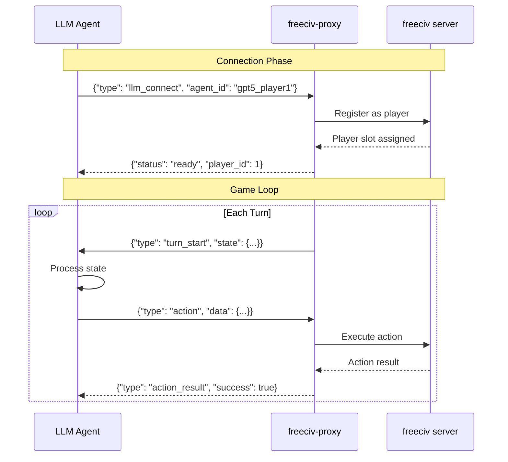

### 4.2 Message Formats

```jsx
// State Update (Proxy -> Agent)
{
  "type": "state_update",
  "timestamp": 1234567890,
  "data": {
    "turn": 42,
    "phase": "movement",
    "observation": {
      "strategic": {...},  // High-level summary
      "tactical": {...},   // Current situation
      "economic": {...}    // Resource state
    },
    "legal_actions": [...]  // Pre-filtered actions
  }
}

// Action Request (Agent -> Proxy)
{
  "type": "action",
  "agent_id": "gpt5_player1",
  "data": {
    "action_type": "unit_move",
    "actor_id": 42,
    "target": {"x": 5, "y": 7}
  }
}

```

## 5. Performance Optimizations for LLM Gameplay

### 5.1 State Compression and Caching

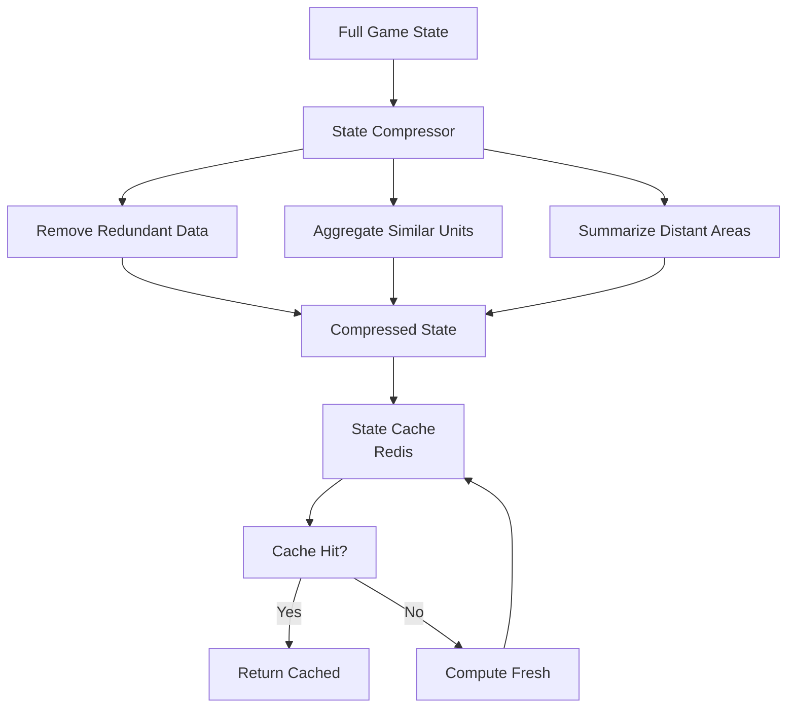

### 5.2 Action Space Reduction

```python
class ActionSpaceOptimizer:
    def reduce_action_space(self, all_actions: List[FreeCivAction],
                           game_state: FreeCivState) -> List[FreeCivAction]:
        """Reduce action space to most relevant actions for LLMs"""

        # Score actions by strategic importance
        scored_actions = []
        for action in all_actions:
            score = self._score_action(action, game_state)
            scored_actions.append((score, action))

        # Return top N actions
        scored_actions.sort(reverse=True)
        return [action for _, action in scored_actions[:20]]

    def _score_action(self, action: FreeCivAction, state: FreeCivState) -> float:
        """Score action based on game situation"""
        score = 0.0

        if action.action_type == "unit_move":
            # Prioritize exploration, threats, objectives
            score += self._score_movement(action, state)
        elif action.action_type == "city_production":
            # Prioritize based on needs
            score += self._score_production(action, state)

        return score

```

## 6. Testing Framework

### 6.1 MVP Test Suite

```python
# tests/test_mvp_integration.py
class TestMVPIntegration(unittest.TestCase):
    def setUp(self):
        self.game_arena = GameArenaServer(MVP_CONFIG)
        self.freeciv_server = FreeCiv3DServer(MVP_CONFIG)

    async def test_single_game_completion(self):
        """Test that a single game can complete successfully"""
        # Start servers
        await self.freeciv_server.start()
        await self.game_arena.start()

        # Connect agents
        agent1 = MockLLMAgent("player1")
        agent2 = MockLLMAgent("player2")

        # Run game
        result = await self.game_arena.run_game(agent1, agent2)

        self.assertIsNotNone(result.winner)
        self.assertLess(result.turns, 200)

```

## 7. Implementation Timeline

### Phase 1: Core Infrastructure (Week 1-2)

- Set up Game Arena server with FreeCiv state adapter
- Implement WebSocket client for FreeCiv3D communication
- Basic action parsing and validation

### Phase 2: FreeCiv3D Modifications (Week 2-3)

- Extend freeciv-proxy for headless LLM support
- Implement state extraction service
- Add LLM-specific protocol handlers

### Phase 3: LLM Optimization (Week 3-4)

- Implement enhanced prompt generation
- Add state compression and caching
- Optimize action space reduction

### Phase 4: Testing and Refinement (Week 4-5)

- End-to-end testing with actual LLMs
- Performance tuning
- Documentation

## 8. Security and Monitoring

### 8.1 Security Measures

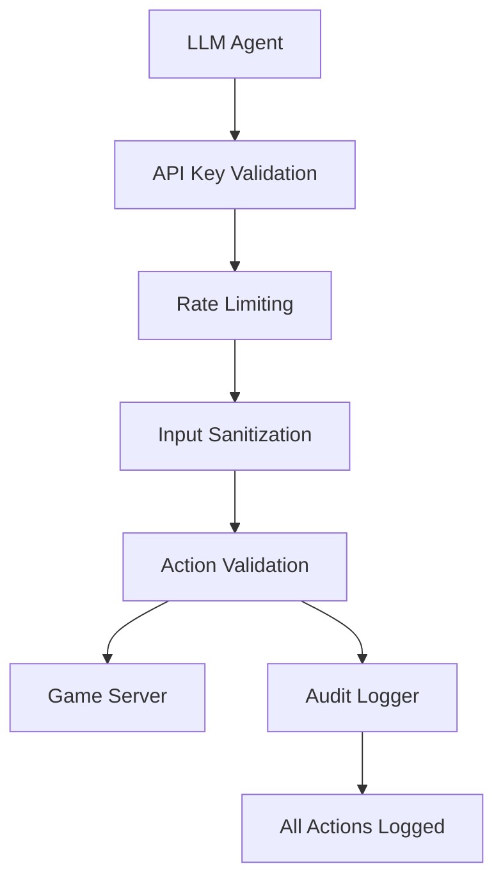

### 8.2 Monitoring Dashboard

```python
class GameMonitor:
    def __init__(self):
        self.metrics = {
            'turn_times': [],
            'action_success_rate': {},
            'llm_response_times': [],
            'state_sizes': []
        }

    def log_turn(self, player_id: str, turn_time: float, actions: int):
        """Log turn metrics for analysis"""
        self.metrics['turn_times'].append(turn_time)
        # Additional metric collection

```

---

## Appendix A: Future Enhancements

### A.1 Tournament Infrastructure

*Post-MVP: Support for multiple concurrent games, brackets, and rankings*

### A.2 Multi-Game Support

*Extension to other strategy games beyond FreeCiv*

### A.3 Advanced LLM Features

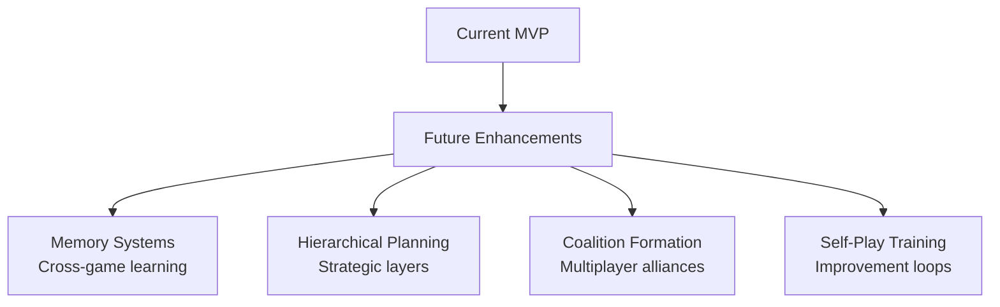

### A.4 Enhanced Observation Formats

- Visual rendering for multimodal models
- Graph-based state representations
- Temporal difference observations

### A.5 Advanced Prompt Engineering

- Few-shot examples from expert games
- Chain-of-thought reasoning templates
- Strategic planning frameworks

## Ctd

### 11.1 Monitoring Architecture

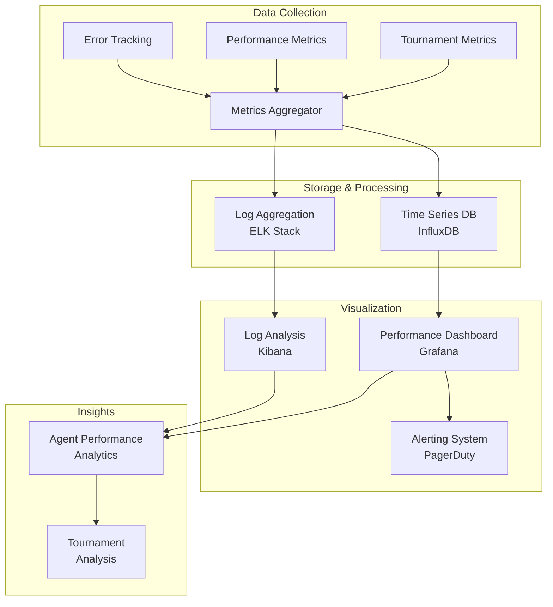

### 11.2 Metrics Collection

```python
class TournamentMetrics:
    def __init__(self):
        self.action_counts = Counter()
        self.response_times = []
        self.error_rates = {}

    def record_action(self, agent_id: str, action: FreeCivAction, response_time: float):
        self.action_counts[action.action_type] += 1
        self.response_times.append(response_time)

    def get_performance_summary(self) -> dict:
        return {
            "avg_response_time": statistics.mean(self.response_times),
            "action_distribution": dict(self.action_counts),
            "total_actions": sum(self.action_counts.values())
        }

```

### 11.3 Logging Strategy

- Structured logging with correlation IDs
- Game state snapshots at key points
- Agent decision reasoning capture
- Performance bottleneck identification

## 12. Future Extensions

### 12.1 Extension Architecture

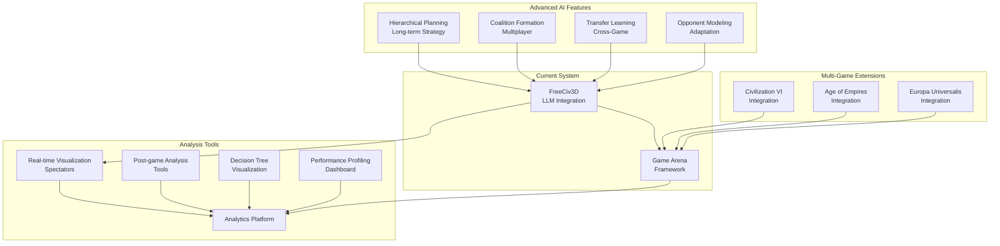

### 12.2 Multi-Game Support

- Abstract base classes for other strategy games
- Shared tournament infrastructure
- Cross-game agent performance analytics

### 12.3 Advanced AI Features

- Hierarchical planning for long-term strategy
- Coalition formation in multiplayer games
- Transfer learning across game variants
- Opponent modeling and adaptation

### 12.4 Visualization and Analysis

- Real-time game visualization for spectators
- Post-game analysis tools
- Agent decision tree visualization
- Performance profiling dashboards

This specification provides a complete roadmap for integrating LLM agents into FreeCiv3D while maintaining system reliability and enabling rich tournament experiences.