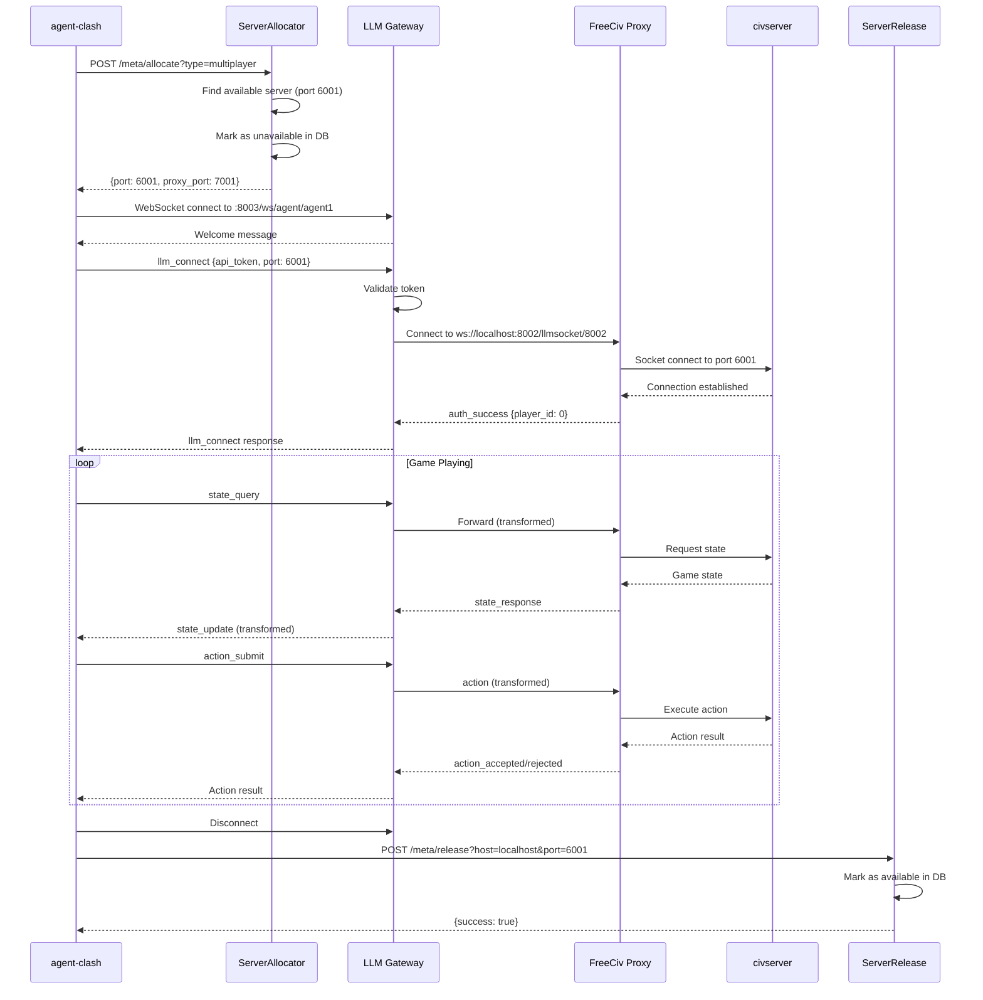

# LLM Gateway for FreeCiv3D

A FastAPI-based WebSocket gateway that enables AI agents (via agent-clash) to play FreeCiv through a standardized API. The gateway provides connection management, authentication, rate limiting, message transformation, and integration with FreeCiv's server allocation system.

## Architecture Overview

The LLM Gateway acts as a **pass-through layer** between agent-clash LLM agents and the FreeCiv proxy, transforming message formats while maintaining low latency.

```
┌─────────────────────────────────────────────────────────────────┐
│                        agent-clash                               │
│                  (External LLM orchestrator)                     │
└────────┬─────────────────────────────────────┬──────────────────┘
         │                                     │
         │ 1. POST /meta/allocate             │ 6. POST /meta/release
         │    (get server port)                │    (return to pool)
         ↓                                     ↓
┌─────────────────────────────────────────────────────────────────┐
│  ServerAllocator          FreeCiv Web (Tomcat:8080)  ServerRelease│
│  [marks unavailable] ←────── MySQL Database ──────→ [marks available]│
└────────┬──────────────────────────────────────────────────────────┘
         │
         │ Returns: {"port": 6001, "proxy_port": 7001}
         │
         ↓ 2. Connect agents to llm-gateway
┌─────────────────────────────────────────────────────────────────┐
│               LLM Gateway (port 8003)                            │
│         ws://localhost:8003/ws/agent/{agent_id}                 │
│  • Rate limiting, authentication                                 │
│  • Connection management                                         │
│  • Message transformation (agent ↔ proxy format)                │
└────────┬─────────────────────────────────────────────────────────┘
         │
         │ 3. Forward via websocket_handlers.py
         ↓
┌─────────────────────────────────────────────────────────────────┐
│          FreeCiv Proxy (port 8002)                               │
│         ws://localhost:8002/llmsocket/8002                      │
│  • LLM handler endpoint                                          │
│  • Protocol translation (WebSocket ↔ TCP)                       │
└────────┬─────────────────────────────────────────────────────────┘
         │
         │ 4. Forward to game server
         ↓
┌─────────────────────────────────────────────────────────────────┐
│          FreeCiv C Server (port 6001)                            │
│          Game logic, state management                            │
└─────────────────────────────────────────────────────────────────┘
```

## Components

### 1. Server Allocation System

FreeCiv3D uses a **dynamic server pool** pattern to support concurrent LLM games without port conflicts.

#### ServerAllocator Servlet

**Endpoint**: `POST /meta/allocate`

**Purpose**: Allocates an available game server from the pool for a new LLM game.

**Request Parameters**:
```http
POST /meta/allocate?type=multiplayer HTTP/1.1
Host: localhost:8080
Content-Type: application/x-www-form-urlencoded

type=multiplayer
```

**Supported Types**:
- `singleplayer` - Single LLM agent vs AI
- `multiplayer` - Multiple LLM agents competing
- `pbem` - Play-by-email (asynchronous)
- `longturn` - Extended games with long turn timers

**Response** (Success):
```json
{
  "success": true,
  "host": "localhost",
  "port": 6001,
  "proxy_port": 7001,
  "type": "multiplayer"
}
```

**Response** (No Servers Available):
```json
{
  "success": false,
  "error": "No available servers for game type: multiplayer"
}
```

**Implementation** ([ServerAllocator.java:78-89](../freeciv-web/src/main/java/org/freeciv/servlet/ServerAllocator.java#L78-L89)):
```sql
-- Find available server
SELECT host, port FROM servers
WHERE type = ? AND state = 'Pregame' AND available = 1
ORDER BY port LIMIT 1

-- Mark as unavailable
UPDATE servers SET available = 0, stamp = NOW()
WHERE host = ? AND port = ?
```

**Proxy Port Calculation**:
```java
int proxyPort = port + 1000;  // 6001 → 7001, 6002 → 7002, etc.
```

#### ServerRelease Servlet

**Endpoint**: `POST /meta/release`

**Purpose**: Returns a game server to the available pool after an LLM game completes.

**Request Parameters**:
```http
POST /meta/release HTTP/1.1
Host: localhost:8080
Content-Type: application/x-www-form-urlencoded

host=localhost&port=6001
```

**Response** (Success):
```json
{
  "success": true,
  "host": "localhost",
  "port": 6001,
  "message": "Server released and available"
}
```

**Response** (Server Not Found):
```json
{
  "success": false,
  "error": "Server not found or already released"
}
```

**Implementation** ([ServerRelease.java:85-89](../freeciv-web/src/main/java/org/freeciv/servlet/ServerRelease.java#L85-L89)):
```sql
-- Return server to pool
UPDATE servers SET available = 1, state = 'Pregame', stamp = NOW()
WHERE host = ? AND port = ?
```

#### MetaserverClient (Python)

The gateway provides a Python client for calling these servlets ([metaserver_client.py](metaserver_client.py)):

```python
from llm_gateway.metaserver_client import metaserver_client

# Allocate a server
server_info = await metaserver_client.allocate_server(game_type="multiplayer")
# Returns: {"host": "localhost", "port": 6001, "proxy_port": 7001, "type": "multiplayer"}

# Use the server...
# Connect agents to ws://localhost:8003/ws/agent/{agent_id}
# Configure proxy connection to port 7001

# Release when done
success = await metaserver_client.release_server("localhost", 6001)
```

**With Retry Logic**:
```python
# Automatic retry with exponential backoff
server_info = await metaserver_client.allocate_with_retry(
    game_type="multiplayer",
    max_attempts=3,
    retry_delay=2.0
)
```

**Check Server Status**:
```python
status = await metaserver_client.get_server_status()
# Returns: {"total": 10, "single": 5, "multi": 5}
```

### 2. WebSocket Gateway (Port 8003)

The FastAPI gateway connects agent-clash agents to FreeCiv via WebSocket.

#### Agent Endpoint

**Endpoint**: `ws://localhost:8003/ws/agent/{agent_id}`

**Authentication**: Required via `api_token` in first message

**Connection Flow**:
```python
import websockets
import json

async with websockets.connect("ws://localhost:8003/ws/agent/my_agent") as ws:
    # 1. Authenticate
    await ws.send(json.dumps({
        "type": "llm_connect",
        "agent_id": "my_agent",
        "data": {
            "api_token": "test-token-fc3d-001",
            "port": 6001,  # From ServerAllocator
            "nation": "French",
            "leader_name": "Napoleon"
        }
    }))

    # 2. Receive auth response
    response = json.loads(await ws.recv())
    # {"type": "llm_connect", "data": {"type": "auth_success", "player_id": 0, ...}}

    # 3. Query game state
    await ws.send(json.dumps({
        "type": "state_query",
        "data": {
            "format": "llm_optimized"
        }
    }))

    # 4. Receive state update
    state = json.loads(await ws.recv())
    # {"type": "state_update", "turn": 1, "players": {...}, ...}

    # 5. Submit action
    await ws.send(json.dumps({
        "type": "action_submit",
        "data": {
            "action_type": "unit_move",
            "unit_id": 123,
            "target": {"x": 10, "y": 15}
        }
    }))

    # 6. Receive action result
    result = json.loads(await ws.recv())
    # {"type": "action_accepted", ...} or {"type": "action_rejected", ...}
```

### 3. Message Transformation

The gateway transforms messages between agent-clash format (nested `data` fields) and proxy format (flat fields).

#### Agent → Proxy Transformation

**Agent Format** (agent-clash):
```json
{
  "type": "action_submit",
  "agent_id": "my_agent",
  "timestamp": 1234567890,
  "data": {
    "action_type": "unit_move",
    "unit_id": 123,
    "target": {"x": 10, "y": 15}
  }
}
```

**Proxy Format** (freeciv-proxy):
```json
{
  "type": "action",
  "action": {
    "action_type": "unit_move",
    "unit_id": 123,
    "target": {"x": 10, "y": 15}
  }
}
```

#### Proxy → Agent Transformation

**Proxy Format**:
```json
{
  "type": "state_response",
  "data": {
    "turn": 42,
    "players": {...}
  },
  "format": "llm_optimized"
}
```

**Agent Format**:
```json
{
  "type": "state_update",
  "turn": 42,
  "players": {...},
  "format": "llm_optimized"
}
```

### 4. Supported Actions

The LLM Gateway supports various FreeCiv actions. Below are some key examples:

#### City Building

LLM agents can build cities using the `unit_build_city` action:

```json
{
  "type": "action_submit",
  "data": {
    "action_type": "unit_build_city",
    "unit_id": 102,
    "name": "NewCity"
  }
}
```

**Fields:**
- `unit_id` (required): ID of the settler/worker unit
- `name` (optional): Custom city name. Defaults to `City{unit_id}` if not provided

**Note:** The current implementation uses auto-generated city names for simplicity. A future enhancement will support server-suggested culturally-appropriate names based on the civilization (e.g., "Rome", "Antium" for Romans). See Linear issue [AGE-199](https://linear.app/agentclash/issue/AGE-199) for details.

**Protocol Details:**
- Internally converts to `PACKET_UNIT_DO_ACTION` (pid: 84) with `ACTION_FOUND_CITY` (27)
- Automatically looks up the unit's tile location from game state
- Matches FreeCiv web client behavior

#### Other Actions

Other supported action types include:
- `unit_move`: Move unit to coordinates
- `unit_fortify`: Fortify unit in place
- `unit_build_road`: Build road at unit location
- `unit_build_irrigation`: Build irrigation at unit location
- `tech_research`: Research a technology
- `end_turn`: End the current turn

See [freeciv-proxy/llm_handler.py](../freeciv-proxy/llm_handler.py) for complete action list and packet conversions.

## Port Reference

| Service | Port | Purpose | Access |
|---------|------|---------|--------|
| nginx | 8080 | Web interface | External (`:8080`) |
| Tomcat | 8080 | Java servlets | Internal (via nginx) |
| **LLM Gateway** | **8003** | **WebSocket API for agent-clash** | **External (`:8003`)** |
| **FreeCiv Proxy** | **8002** | **Main WebSocket proxy** | **External (`:8002`)** |
| Game servers | 6000-6009 | FreeCiv C server instances | Internal only |
| Proxy per-game | 7000-7009 | Dedicated per-game proxies | Internal only |
| MySQL | 3306 | Metaserver database | Internal only |
| Redis | 6379 | Cache & rate limiting | Internal only |

## Configuration

### Environment Variables

Set in [docker-compose.yml](../docker-compose.yml) or `.env` file:

```bash
# Authentication
LLM_API_TOKENS=test-token-fc3d-001,test-token-fc3d-002
API_KEY_SECRET=your_secret_key_here

# Capacity Limits
MAX_LLM_AGENTS=10                    # Max concurrent agents
MAX_SESSIONS_PER_PLAYER=3            # Sessions per player
SESSION_TIMEOUT_SECONDS=3600         # 1 hour session timeout

# Rate Limiting (Updated for 2-4 player concurrent games)
GATEWAY_RATE_LIMIT_REQUESTS_PER_MINUTE=200  # Increased from 100
GATEWAY_RATE_LIMIT_BURST_SIZE=40            # Increased from 20
GATEWAY_RATE_LIMIT_GRACE_PERIOD=30          # Seconds before blocking
GATEWAY_RATE_LIMIT_MAX_VIOLATIONS=3         # Violations before block
MAX_MESSAGE_SIZE_BYTES=104857600            # 100MB for large game states

# Session Management (Updated for longer games and reconnection)
GATEWAY_AGENT_TIMEOUT=600                   # 10 minutes (was 120s)
GATEWAY_SESSION_RESUMPTION_WINDOW=60        # 60s to resume after disconnect

# Caching
CACHE_TTL_SECONDS=5                  # State cache TTL
CACHE_HMAC_SECRET=your_hmac_secret

# Connection
DEFAULT_CIVSERVER_PORT=6001          # Default game server port
REDIS_HOST=redis
REDIS_PORT=6379
```

### Production Recommendations

**Security**:
- Use strong, random values for `API_KEY_SECRET` and `CACHE_HMAC_SECRET` (64+ chars)
- Rotate `LLM_API_TOKENS` regularly
- Enable HTTPS/WSS in production (nginx SSL termination)
- Restrict network access to port 8003 (firewall rules)

**Performance**:
- Increase `MAX_LLM_AGENTS` based on server capacity
- Tune `CACHE_TTL_SECONDS` to balance freshness vs load
- Monitor Redis memory usage (state cache can grow large)
- Consider increasing `MAX_MESSAGE_SIZE_BYTES` for large maps

**Reliability**:
- Set `SESSION_TIMEOUT_SECONDS` appropriate to game length
- Configure health checks in orchestration (Kubernetes, Docker Swarm)
- Enable structured logging for debugging

## Development

### Running Locally

```bash
# 1. Start dependencies (from project root)
docker-compose up -d db redis

# 2. Set environment variables
export CACHE_HMAC_SECRET="dev-secret-12345678901234567890123456789012"
export API_KEY_SECRET="dev-key-12345678901234567890"
export LLM_API_TOKENS="test-token-1,test-token-2"

# 3. Start freeciv-proxy
cd freeciv-proxy
python3 freeciv-proxy.py &

# 4. Start LLM gateway
cd llm-gateway
pip install -r requirements.txt
uvicorn main:app --host 0.0.0.0 --port 8003 --reload
```

### Testing

```bash
# Unit tests
cd llm-gateway
pytest tests/

# Integration test with mock agent
python3 tests/test_agent_connection.py

# Load testing
python3 tests/load_test_gateway.py --agents 10 --duration 60
```

### Debugging

**Enable Debug Logging**:
```bash
export LOG_LEVEL=DEBUG
uvicorn main:app --log-level debug
```

**Common Issues**:

1. **"Connection refused" on port 8003**
   - Check if gateway is running: `docker logs fciv-net | grep "LLM Gateway"`
   - Verify port mapping in docker-compose.yml

2. **"Invalid API token"**
   - Confirm `LLM_API_TOKENS` environment variable is set
   - Check token in `llm_connect` message matches configured tokens

3. **"No available servers"**
   - Verify civservers are running: `docker exec fciv-net ps aux | grep civserver`
   - Check database: `docker exec fciv-db mysql -u docker -pchangeme freeciv_web -e "SELECT * FROM servers;"`
   - Run publite2 to launch servers if needed

4. **WebSocket disconnects (code 1006)**
   - Usually means proxy connection failed
   - Check freeciv-proxy logs: `docker logs fciv-net | grep "freeciv-proxy"`
   - Verify `port` in `llm_connect` message matches allocated server

5. **E429 - Rate Limit Exceeded**
   - **Symptoms**: `Rate limit exceeded: Request rate limit exceeded` errors
   - **Cause**: Too many messages per minute/second for concurrent players
   - **Solution**: Increase `GATEWAY_RATE_LIMIT_REQUESTS_PER_MINUTE` and `GATEWAY_RATE_LIMIT_BURST_SIZE`
   - **Grace Period**: You get 3 violations within 30 seconds before blocking
   - **Recovery**: Wait for grace period to reset or block to expire (60s)
   - **Check status**: Look for `grace_period` details in error response

6. **E120 - Not Authenticated / Session Expired**
   - **Symptoms**: `Not authenticated - please send llm_connect message first`
   - **Cause**: Session expired after disconnect or timeout
   - **Solution**:
     - Reconnect within 60 seconds to resume session automatically
     - Otherwise send new `llm_connect` message to reauthenticate
   - **Prevention**: Increase `GATEWAY_AGENT_TIMEOUT` for longer games (default: 600s)

7. **E123 - Connection to Game Server Lost**
   - **Symptoms**: `Connection to game server lost`
   - **Cause**: FreeCiv proxy disconnected or civserver crashed
   - **Solution**:
     - Check civserver status: `docker exec fciv-net ps aux | grep civserver`
     - Check proxy logs: `docker logs fciv-net | grep "freeciv-proxy"`
     - Reconnect with same agent_id within 60s to resume session
   - **Prevention**: Monitor civserver health, increase timeouts if network unstable

8. **E999 - Unknown Error**
   - **Symptoms**: Generic errors with `exception_type` in details
   - **Cause**: Unexpected exceptions (not E120/E123/E429)
   - **Solution**: Check error details for `exception_type` and `reason`
   - **Report**: Include full error response with details when reporting bugs

## Architecture Details

### Connection Lifecycle



### Threading Model

**FastAPI (Gateway)**:
- Async/await with asyncio event loop
- One event loop per process
- WebSocket connections run as async tasks
- Non-blocking I/O for all operations

**Tornado (Proxy)**:
- IOLoop-based event loop (main thread)
- CivCom worker threads for blocking socket I/O
- Critical: Worker threads MUST use `conn.io_loop.add_callback()` to send messages
- Prevents threading violations that cause silent packet drops

### Rate Limiting

The gateway implements **token bucket** rate limiting per agent:

```python
# comprehensive_rate_limiter (utils/rate_limiter.py)
class ComprehensiveRateLimiter:
    async def check_rate_limits(self, agent_id: str, message_size: int):
        # 1. Message size check (1MB default)
        if message_size > MAX_MESSAGE_SIZE_BYTES:
            return False, "Message too large"

        # 2. Token bucket (10 req/sec default, burst 100)
        if not self._has_tokens(agent_id):
            return False, "Rate limit exceeded"

        # 3. Concurrent connection check
        if self._connection_count(agent_id) > MAX_CONNECTIONS:
            return False, "Too many connections"

        return True, None
```

### State Caching

The proxy caches game state in Redis to reduce civserver load:

```python
# Cache key format
cache_key = f"state:{game_id}:{player_id}:{turn}"

# TTL: 5 seconds default (configurable via CACHE_TTL_SECONDS)
# Cache invalidation: Automatic on turn change, manual on action submit
# HMAC signature: Prevents cache poisoning
```

## References

- [Technical Specification](../Technical_Spec.md) - Full architecture documentation
- [CLAUDE.md](../CLAUDE.md) - Developer guidance for AI assistants
- [docker-compose.yml](../docker-compose.yml) - Service configuration
- [agent-clash Integration](https://github.com/anthropics/agent-clash) - External LLM orchestrator
